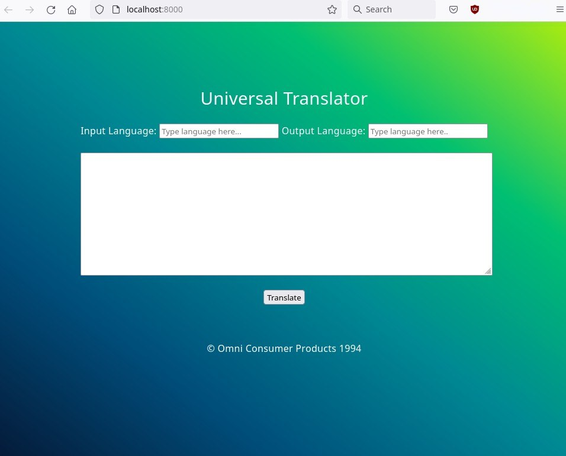

# Universal Translator #

Alfa Version 0.0.1  
*Will work until it does not*
  
This is an offline translator that utilizes several ML models. (Only m2m100 as of version 0.0.1)  

UniversalTranslationServer must be started for the Universal Translator to work. 


### Design ###



## Setup ##
*Create a virtual env*  
```python3 -m venv ./venv```  
*Activate venv*  
```source venv/bin/activate```  
*Download repositories*  
```pip install -r requirements.txt```  

## Start ##  
**To start the webserver**  
```uvicorn main:app --reload```  


## Docker start ##
```
docker build -t universaltranslator:1.0 ./  
docker-compose up  
```
